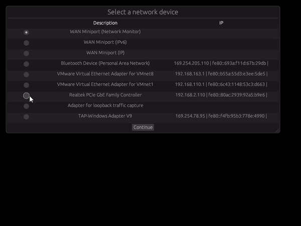

# Network Visualizer


This is a nice and funny tool built with rust to visualize IP packets paths in a network. It can be helpful to better visualize packets traffic within a network, each red dot represents a single packet and each yellow circle represents a node in the network, by hovering each node is possible to check the number of packets sent/received from that particular node.

This is a work in progress and the main purpose is to learn more about rust, 2d graphics and networking in general, so expect some bugs and an ugly interface.

## How to use
- Install libcap (Linux) or winpcap(Windows), for more info check [pcap](https://docs.rs/pcap/latest/pcap)
- Run ```cargo run```
- Select the network interface to capture packets

## Features
- Captures and store packets headers by node
- Visualize packets paths
- Visualize ammount of packets sent/received by each node

## Main dependencies
- [Macroquad](https://github.com/not-fl3/macroquad) - For the primitives drawing
- [egui](https://github.com/not-fl3/macroquad) - For the UI
- [pcap](https://docs.rs/pcap/latest/pcap/) - For the packet capture

## For the future
- Improve graphics visualization
- Add filter to hide nodes
- Improve packet movements to avoid infinite orbits
- Add table with amount of packets sent/received by each node to tooltip
- Add clustering to put the nodes closer to each other based on the IP octets
- Improve drawing speed, maybe by calculating trajectory in GPU
